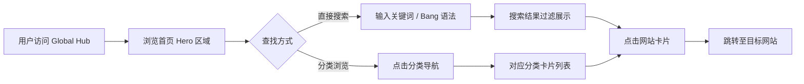

# Global Hub 产品需求文档 (PRD)

## 1. 产品概述

Global Hub 是一个高质量网址导航网站，致力于打破信息茧房、消除信息差，让任何人都能零门槛接触世界最前沿的一手资讯和最优质的工具，实现信息平权。

- **核心目标**：聚合全球最有价值的网站，提供简洁高效的导航体验
- **目标用户**：科技从业者、研究者、学生、终身学习者，以及所有渴望获取高质量信息的人
- **产品价值**：精心筛选的链接 + 深度洞察的简介 + 极客风格的交互体验

---

## 2. 核心功能

### 2.1 用户角色

| 角色 | 注册方式 | 核心权限 |
|------|----------|----------|
| 访客 | 无需注册 | 浏览所有分类、搜索网站、切换主题/语言 |

### 2.2 功能模块

1. **首页**：Hero 区域、全局搜索、分类导航、网站卡片网格
2. **AI 前沿专区**：大尺寸突出展示，细分 Research/Industry/Community
3. **分类浏览**：六大核心分类，卡片式网格布局
4. **智能搜索**：站内搜索 + Bang 语法快捷跳转
5. **主题切换**：浅色/深色模式一键切换
6. **双语支持**：中英文界面无缝切换

### 2.3 页面详情

| 页面名称 | 模块名称 | 功能描述 |
|----------|----------|----------|
| 首页 | Hero Section | 品牌 Slogan、全局搜索框、语言/主题切换按钮 |
| 首页 | 分类导航栏 | 固定顶部，六大分类快速切换，高亮当前分类 |
| 首页 | AI 前沿专区 | 大尺寸卡片突出展示，细分三个子分类，New 标签闪烁提示 |
| 首页 | 网站卡片网格 | 响应式 Grid 布局，悬停显示简介和最后更新时间 |
| 首页 | 页脚 | 版权信息、开源链接、联系方式 |

---

## 3. 核心流程

用户打开网站 → 浏览 Hero 区域和分类 → 通过搜索或分类导航找到目标网站 → 点击卡片跳转 → 享受信息平权带来的价值

---

## 4. 用户界面设计

### 4.1 设计风格

- **主色调**：白色 / 浅灰色背景，营造简洁干净的基调
- **高亮色**：科技蓝（#3B82F6 系列），用于强调和交互元素
- **深色模式**：深灰背景（#0F172A / #1E293B），蓝色高亮保持一致
- **按钮风格**：圆角、微妙阴影、hover 时有轻微上浮和变色
- **字体**：使用现代无衬线字体，确保清晰易读
- **布局风格**：卡片式网格布局，留白充足，呼吸感强
- **图标风格**：简洁线条图标或网站 Logo，统一视觉语言
- **网站 Logo 规范**：**必须使用各网站对应的真实 Logo，禁止使用 emoji 或随意编造的图标占位。** 采用三级 fallback 策略：①优先使用本地缓存文件 `assets/icons/{id}.png`（通过 `scripts/fetch-icons.mjs` 脚本预下载，零网络请求加载最快）→ ②Google Favicon API（`https://www.google.com/s2/favicons?sz=64&domain=域名`）→ ③DuckDuckGo 图标服务（`https://icons.duckduckgo.com/ip3/域名.ico`），确保每个卡片展示的都是该网站真实的品牌标识，同时通过本地缓存最大化加载速度
- **整体调性**：极客、现代、精致、参考 Stripe / Linear 的设计美学

### 4.2 页面设计概览

| 页面名称 | 模块名称 | UI 元素 |
|----------|----------|---------|
| 首页 | Hero Section | 大标题（渐变文字效果）、副标题、搜索框（带图标和圆角）、右上角主题/语言切换按钮、微妙的背景渐变 |
| 首页 | 分类导航 | 横向滚动标签栏，激活态蓝色下划线，平滑过渡动画 |
| 首页 | AI 前沿专区 | 更大的卡片尺寸、特殊的边框高亮、New 标签脉冲动画、三列子分类布局 |
| 首页 | 网站卡片 | 圆角卡片、微妙阴影、hover 时上浮 + 阴影加深、图标 + 名称 + 简介、底部更新时间小字 |
| 首页 | 页脚 | 细线分隔、小字版权、居中布局 |

### 4.3 响应式设计

- **设计策略**：Desktop-first，移动端自适应
- **断点设计**：
  - 桌面端（>1024px）：4-6 列网格
  - 平板（768-1024px）：3 列网格
  - 手机（<768px）：1-2 列网格，导航变为横向滚动
- **触控优化**：卡片增大点击区域，按钮最小 44px

### 4.4 交互动效

- **页面加载**：卡片交错淡入动画（staggered fade-in）
- **悬停效果**：卡片轻微上浮 + 阴影加深 + 边框变色
- **New 标签**：脉冲呼吸动画，吸引注意力
- **搜索过滤**：平滑的显示/隐藏过渡
- **主题切换**：颜色渐变过渡，不闪烁
