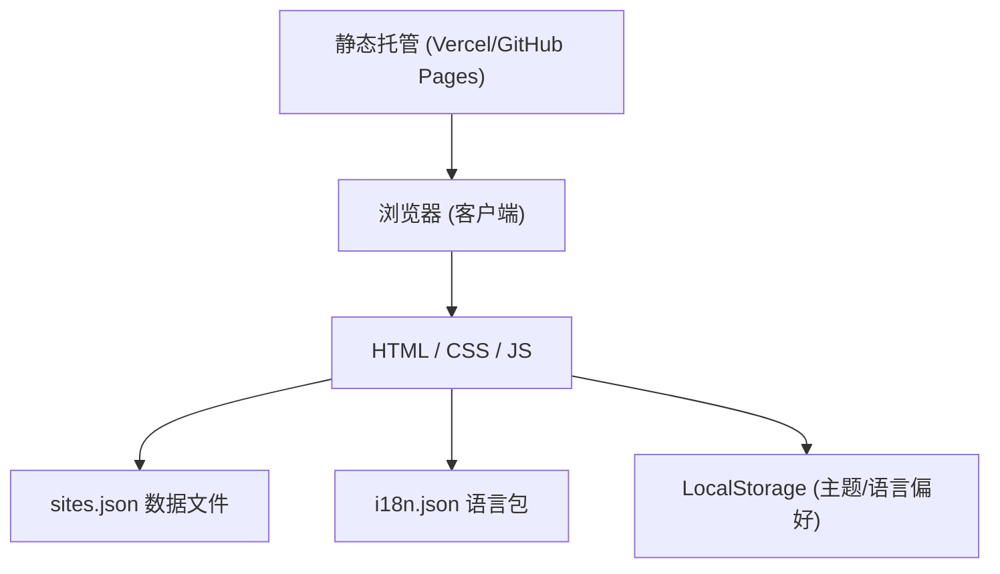

# Global Hub 技术架构文档

## 1. 架构设计

项目采用纯静态架构，无需后端服务，所有数据存储在 JSON 文件中，可直接部署到 GitHub Pages / Vercel / Cloudflare Pages 等静态托管平台。



---

## 2. 技术选型

- **前端框架**：Vanilla JavaScript（原生 JS，无框架依赖，轻量高效）
- **样式方案**：Tailwind CSS v3（通过 CDN 引入，零构建配置）
- **数据存储**：JSON 文件（sites.json、i18n.json）
- **字体**：现代无衬线字体栈（Geist / system-ui）
- **部署方式**：纯静态页面，支持任意静态托管

**选择理由**：
- 项目为 MVP 阶段，内容型网站，无需复杂框架
- Tailwind CDN 让项目开箱即用，无需构建流程
- 原生 JS 保证最轻量的包体积和最快的加载速度
- 纯静态架构便于维护和部署，成本极低

---

## 3. 文件结构

```
global-hub/
├── index.html          # 主页面
├── css/
│   └── style.css       # 自定义样式（补充 Tailwind）
├── js/
│   └── app.js          # 主逻辑（数据加载、搜索、主题切换等）
├── data/
│   ├── sites.json      # 网站数据
│   └── i18n.json       # 多语言文案
├── assets/
│   └── icons/          # 网站图标 / SVG 图标
└── README.md           # 项目说明（可选）
```

---

## 4. 数据模型

### 4.1 网站数据 (sites.json)

```json
{
  "categories": [
    {
      "id": "ai-frontier",
      "name": {
        "en": "AI Frontier",
        "zh": "AI 前沿"
      },
      "featured": true,
      "subcategories": [
        {
          "id": "research",
          "name": {
            "en": "Research",
            "zh": "学术研究"
          }
        }
      ]
    }
  ],
  "sites": [
    {
      "id": "arxiv",
      "name": "arXiv",
      "url": "https://arxiv.org",
      "desc": {
        "en": "Open access to over 2 million scholarly articles",
        "zh": "超过 200 万篇学术论文的开放获取平台，AI 领域必读"
      },
      "category": "ai-frontier",
      "subcategory": "research",
      "isNew": false,
      "lastUpdated": "2024-01-15"
    }
  ]
}
```

### 4.2 多语言文案 (i18n.json)

```json
{
  "en": {
    "heroTitle": "Connect to the World's Best Information",
    "heroSubtitle": "Break free from information bubbles. Discover the most valuable websites curated for the curious mind.",
    "searchPlaceholder": "Search sites or use !bang syntax...",
    "darkMode": "Dark Mode",
    "lightMode": "Light Mode"
  },
  "zh": {
    "heroTitle": "连接世界最优质的信息",
    "heroSubtitle": "打破信息茧房，为好奇心精选全球最有价值的网站",
    "searchPlaceholder": "搜索网站，或使用 !bang 快捷语法...",
    "darkMode": "深色模式",
    "lightMode": "浅色模式"
  }
}
```

---

## 5. 核心功能实现方案

### 5.1 数据加载与渲染
- 使用 `fetch API` 异步加载 sites.json
- 使用模板字符串动态生成 DOM
- 按分类分组渲染，支持 featured 特殊样式

### 5.1.1 网站 Logo 处理（重要规范）
**必须使用各网站对应的真实 Logo，禁止使用 emoji 或随意编造的图标。**

#### 本地缓存优先策略（提升加载速度）
Logo 采用**三级 fallback**机制，优先使用已缓存到项目本地的 favicon 文件，避免每次都请求外部 API：

1. **第一优先：本地缓存文件** `assets/icons/{site.id}.png`
   - 通过维护脚本 `scripts/fetch-icons.mjs` 预先下载到项目文件中
   - 前端直接引用本地文件，零网络请求，加载最快
2. **第二优先：Google Favicon API**（本地文件不存在时 fallback）
   - URL 格式：`https://www.google.com/s2/favicons?sz=64&domain={hostname}`
3. **第三优先：DuckDuckGo 图标服务**（Google 也失败时最终 fallback）
   - URL 格式：`https://icons.duckduckgo.com/ip3/{hostname}.ico`
   - 通过 `` 标签的链式 `onerror` 事件实现无缝降级

#### 维护脚本：scripts/fetch-icons.mjs
- **用途**：批量下载所有网站的真实 favicon 到 `assets/icons/` 目录
- **运行方式**：`node scripts/fetch-icons.mjs`
- **下载策略**（按优先级尝试）：
  1. 直连网站 `/favicon.ico`（最可靠，不受第三方 API 限制）
  2. 从网站 HTML 解析 `<link rel="icon">` 标签获取真实图标路径
  3. Google Favicon API（部分地区可能不可用）
- **使用时机**：新增网站后运行一次即可，图标会缓存到本地
- **失败处理**：下载失败的网站在前端会自动 fallback 到在线 API 加载

#### 数据层
- `sites.json` 中不需要 `icon` 字段，Logo 完全由 `site.id` 和 `site.url` 自动推导
- 本地文件命名规则：`assets/icons/{site.id}.png`

#### 渲染函数
- `renderLogo(site, sizeClass)` 统一生成带三级 fallback 的 `` 标签

### 5.2 智能搜索
- 实时过滤：监听 input 事件，匹配 name/desc/category
- Bang 语法：识别 `!` 开头的指令（如 `!gh react`），跳转对应搜索引擎
- 支持的 Bang 命令：`!g` (Google), `!gh` (GitHub), `!ddg` (DuckDuckGo), `!yt` (YouTube), `!wiki` (Wikipedia) 等

### 5.3 主题切换
- 使用 CSS 变量定义颜色
- 通过 `data-theme` 属性切换深浅模式
- 偏好保存到 localStorage

### 5.4 双语切换
- 所有文案从 i18n.json 加载
- 通过 `data-lang` 属性切换语言
- 语言偏好保存到 localStorage
- 浏览器语言自动检测

### 5.5 响应式布局
- Tailwind 响应式类：sm / md / lg / xl
- Grid 布局自适应列数
- 移动端导航栏横向滚动

---

## 6. 性能优化

- **零构建**：Tailwind CDN + 原生 JS，无需打包
- **图片优化**：使用 SVG 图标，避免位图加载
- **懒加载**：非首屏分类可延迟渲染
- **缓存策略**：静态资源设置长期缓存
- **CDN 加速**：使用 Cloudflare / Vercel 边缘网络
